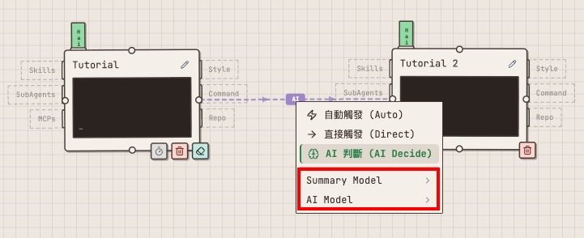
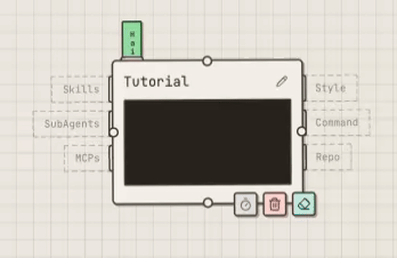
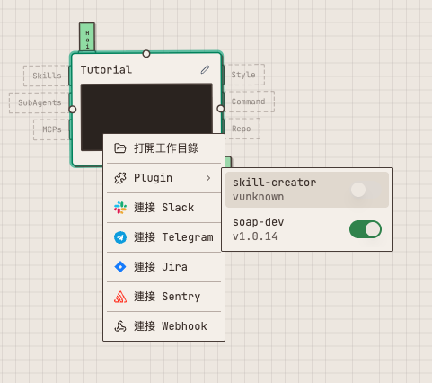
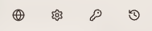

[繁體中文](README.md) | [日本語](README.ja.md)

# Claude Code Canvas

A canvas tool for visually designing and executing AI Agent workflows, powered by Claude Agent SDK for agent execution. Also supports team collaboration.

<video src="https://github.com/user-attachments/assets/58a82eb0-e629-46cc-a944-5ba891692b52" controls width="100%"></video>

## Table of Contents

- [Important Notes](#important-notes)
- [Installation](#installation)
- [Usage](#usage)
- [Configuration](#configuration)
- [Tutorials](#tutorials)
  - [What is a POD?](#what-is-a-pod)
  - [How to Switch Models?](#how-to-switch-models)
  - [Slot Overview](#slot-overview)
  - [Connection Line](#connection-line)
  - [Normal Mode vs Multi-Instance Mode](#normal-mode-vs-multi-instance-mode)
  - [Plugin](#plugin)
  - [Workflow Patterns](#workflow-patterns)
  - [Schedule](#schedule)
  - [Header Buttons](#header-buttons)

## Important Notes

- Recommended for **local environment** use only, not recommended for cloud deployment (no user authentication is implemented).
- Since it uses the **Claude Agent SDK**, make sure the service runs in an environment where **Claude is already logged in**. API Key is not supported.
- Tested on **macOS / Linux**. Other operating systems may have unknown issues.
- Canvas data is stored in `~/Documents/ClaudeCanvas`
- AI is currently granted **maximum permissions**. Please be careful with operations.

## Installation

**Prerequisites:** [Claude Code](https://docs.anthropic.com/en/docs/claude-code) installed and logged in

```bash
curl -fsSL https://raw.githubusercontent.com/cowbear6598/claude-code-canvas/main/install.sh | sh
```

**Uninstall**

```bash
curl -fsSL https://raw.githubusercontent.com/cowbear6598/claude-code-canvas/main/install.sh | sh -s -- --uninstall
```

## Usage

```bash
# Start service (background daemon, default port 3001)
claude-code-canvas start

# Start with custom port
claude-code-canvas start --port 8080

# Check service status
claude-code-canvas status

# Stop service
claude-code-canvas stop

# View latest logs (default 50 lines)
claude-code-canvas logs

# View specific number of log lines
claude-code-canvas logs -n 100
```

Open your browser and navigate to `http://localhost:3001` to get started.

## Configuration

To use Clone features for accessing private repositories, use the `config` command. If you have already logged in with `gh`, you may not need to set the GitHub Token separately.

```bash
# GitHub Token
claude-code-canvas config set GITHUB_TOKEN ghp_xxxxx

# GitLab Token
claude-code-canvas config set GITLAB_TOKEN glpat-xxxxx

# Self-hosted GitLab URL (optional, defaults to gitlab.com)
claude-code-canvas config set GITLAB_URL https://gitlab.example.com

# List all configurations
claude-code-canvas config list
```

## Tutorials

### What is a POD?

- A Pod = Claude Code
- Right-click on the canvas → Pod to create one


### How to Switch Models?

- Hover over the model label on top of the Pod to select Opus / Sonnet / Haiku


### Slot Overview

- Skills / SubAgents / MCPs can hold multiple items
- Style (Output Style) / Command (Slash Command) / Repo can only hold one
- Command will automatically prepend to your message, e.g., `/command message`
- Repo changes the working directory; without one, the Pod uses its own directory


### Connection Line

- Auto: Always triggers the next Pod regardless
- AI: AI decides whether to trigger the next Pod
- Direct: Ignores other Connection Lines and triggers directly


#### Multi-Connection Trigger Rules

When a Pod has multiple incoming Connection Lines:

- Auto + Auto = Pod triggers when both are ready
- Auto + AI = If AI rejects, Pod won't trigger; if AI approves, Pod triggers
- Direct + Direct = When one completes, waits 10 seconds for other Direct lines to finish; if they do, summarizes together then triggers Pod; otherwise, each summarizes independently
- Auto + Auto + Direct + Direct = Split into two groups (Auto group and Direct group) for summarizing; whichever group completes first triggers first, the other group enters the queue

#### Model Settings

Right-click a Connection Line to switch the following models (both default to Sonnet):

- **Summary Model**: The model used to generate summaries passed to downstream Pods
- **AI Model**: The model used to decide whether to trigger downstream Pods (only available in AI mode)



### Normal Mode vs Multi-Instance Mode

Pods default to normal mode. **Long-press the eraser button** to switch to Multi-Instance mode — the button displays an **M** icon when enabled.



#### Normal Mode

- Processes one message at a time; new messages queue while busy
- Integration events are skipped when Pod is busy

#### Multi-Instance Mode

- Each message creates a new Run, enabling parallel execution
- Integration events execute regardless of busy state
- Chat history is viewed through Run history
- When a Git Repo is bound, each Run creates an isolated Worktree, which is automatically cleaned up after execution

### Plugin

Plugins are extensions installed via the Claude CLI that add extra capabilities to Pods.

- Plugins must first be installed via the `claude` CLI (`~/.claude/plugins/`)
- **Right-click** Pod → Plugin → Toggle on/off to enable/disable
- Once enabled, the Plugin is loaded when the Pod processes conversations
- Plugins are separate from Skills, MCP, and SubAgents — they can all be used together



### Workflow Patterns

**Example 1: Code Review (Auto chain)**

```
[Code Reviewer] --Auto--> [Report Generator]
```

- Pod A uses an Output Style slot for structured review output
- Pod B receives the summary and generates a final report
- **Key:** Auto = previous Pod completion auto-triggers next; downstream receives upstream summary

**Example 2: Smart Routing (AI conditional branching)**

```
[Issue Analyzer] --AI--> [Bug Handler]
[Issue Analyzer] --AI--> [Feature Advisor]
```

- AI reads the output and decides which Pod(s) to trigger based on content
- **Key:** AI may trigger multiple, one, or none of the downstream Pods

**Example 3: Parallel Collection + Merge (multi-input aggregation)**

```
[Security Analyst]    --Auto--> [Final Report]
[Performance Analyst] --Auto--> [Final Report]
```

- Final Report triggers only when both upstream Pods have completed
- **Key:** Multi-input Auto waits for all sources before triggering

### Schedule

- Let a Pod execute automatically on a set schedule

**Setup:**

- **Click** the timer button on a Pod → Select frequency → Enable

**Frequency types:**

- Every x seconds
- Every x minutes
- Every x hours
- Every day
- Every week

**Manage:**

- **Edit:** Click timer → Update
- **Disable:** Click timer → Disable

- **When triggered:** Pod status becomes chatting; downstream Workflow is triggered on completion
- **Note:** Schedule depends on the timezone set in Settings; Pod skips the scheduled run if it is already busy

### Header Buttons



Four icons from left to right:

- **Globe icon**: Switch UI language
- **Gear icon**: Global settings (timezone, backup)
- **Key icon**: Integration management (Slack, Telegram, Jira, Sentry, Webhook)
- **Clock icon**: View Run history

#### Language

Click the **globe icon** to switch the UI language:

- 繁體中文 (Traditional Chinese)
- English
- 日本語 (Japanese)

#### Global Settings

Click the **gear icon** to open global settings.

**Timezone**

Set in **Timezone**. Affects the following:

- **Schedule**: "Every day" and "Every week" trigger times are calculated based on this timezone
- **Backup schedule**: Daily auto-backup trigger time is calculated based on this timezone

**Backup**

- **Backup** → Enable → Enter Git Remote URL → Select daily backup time → Save
- Mechanism: Pushes Canvas data to a remote Git repository

> ⚠️ `encryption.key` is not included in the backup.

#### Integration

Click the **key icon** to open integration management. External platform events automatically trigger Pod execution.

**General setup flow:**

1. Select Provider → **Add App** → Fill in Token/Secret → Confirm
2. **Right-click** Pod → Connect Integration → Select registered App → Confirm

**Slack**

- **Requires:** Bot Token (`xoxb-` prefix) + Signing Secret (32 chars)
- **Webhook URL:** `/slack/events`

**Telegram**

- **Requires:** Bot Token (from BotFather)
- **Note:** Private messages only; Resource requires manual User ID input

**Jira**

- **Requires:** Site URL + Webhook Secret (min 16 chars)
- **Webhook URL:** `/jira/events/{appName}`
- **Event filter options:** All / Status Changed

**Sentry**

- **Requires:** Client Secret (min 32 chars)
- **Webhook URL:** `/sentry/events/{appName}`
- **Supports:** created and unresolved events

**Webhook**

Provides a Webhook URL for external programs to call, automatically triggering Pod execution.

- Only a name is required — the system auto-generates a Bearer Token
- External programs trigger a Pod via POST request:

```bash
curl -X POST https://your-host/webhook/events/{appName} \
  -H "Authorization: Bearer {token}" \
  -H "Content-Type: application/json" \
  -d '{"message": "trigger"}'
```

#### History

Click the **clock icon** to open the Run history panel. Only records execution history from Multi-Instance mode.
